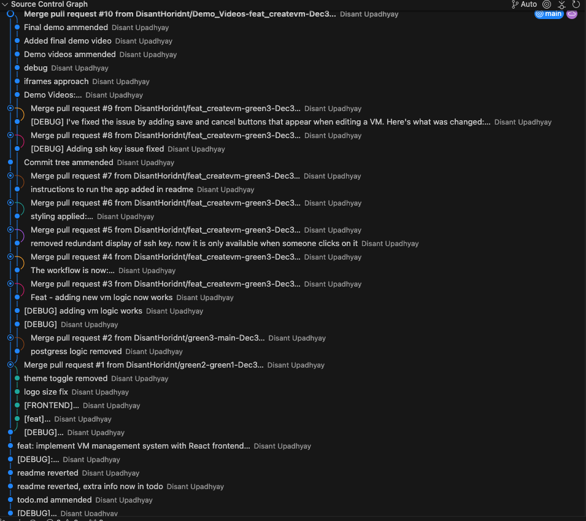

# V2 Cloud VM Management Dashboard

## Key Features

- **VM Lifecycle Management**: Create, view, and manage virtual machines effortlessly
- **SSH Key Management**: Secure and flexible SSH key handling
- **Responsive UI**: Modern, clean interface built with React and Tailwind CSS
- **Quick Configuration**: Instant VM updates with minimal friction

## Prerequisites

- Docker
- Docker Compose

## Quick Start

### Installation

```bash
git clone https://github.com/DisantHoridnt/v2cloud-assessment.git
cd v2cloud-assessment
```

### Running the Application

```bash
docker-compose up --build
```

🌐 Access the dashboard at: `http://localhost:8000/`

## Demo Videos

Experience the dashboard's features through these demonstration videos:

### 🎥 Feature Demonstrations

1. there was an issue with the build in this first video. In this video, you can see that it is not possible to save ssh to a vm that doesnt have one.
    - [▶️ Watch Demo #1](https://drive.google.com/file/d/13FTynGnsIHh9Xae0-B7pfDmMUNolCdm-/preview)

2. I quickly caught this bug and fixed it. Here is the video demonstrating that specific fix:
    - [▶️ Watch Demo #2](https://drive.google.com/file/d/1C1RLCj49lDl9be0soLVdt1C2ZNKqxWlm/preview)

3. Final Video which is a merge between Demo #1 and Demo #2:
    - [▶️ Watch Complete Demo Video](https://drive.google.com/file/d/1WvUxnowj6lLEjjC6eOJAKITI0iw51T2d/preview)    

## Technical Stack

- **Backend**: Django REST Framework
- **Frontend**: React
- **Styling**: Tailwind CSS
- **Containerization**: Docker

***

## Architectural Reasoning

> <strong><mark>I went with a Django and React stack, Django gives us everything we need on the backend - a good ORM, built-in auth, and security, while letting us expose REST APIs through DRF.
On the frontend, React - its component model and hooks make state management straightforward, plus the ecosystem is massive which speeds up development.</mark></strong>

> <strong><mark>I containerized everything with Docker, splitting the Django API (port 8000) and Webpack dev server (3000) into separate containers. This keeps things clean and makes both local development and deployment relatively easy.</mark></strong>

> <strong><mark>For the database, I am using SQLite - I did consider using postgres as you can see in my commit history, it was an overkill. There was no need to overcomplicate things with a separate database server right now. That's why I went with the available sqlite option.</mark></strong>

> <strong><mark>The API follows REST principles with clear endpoints and standard HTTP methods, while Django's serializers handle all our validation and data transformation needs.
The frontend is structured around a main VMGrid component with nested Controls and VMCard components - keeping things modular and maintainable.
I am using Tailwind CSS which has been great for rapid UI development and keeping our bundle size in check.</mark></strong>

> <strong><mark>For development tooling, Webpack handles all our bundling and hot reloading, while Babel ensures our modern JS/JSX works everywhere. I've also put a strong emphasis on error handling throughout the stack, with proper try-catch blocks and validation on both client and server sides.</mark> </strong>

---

## Commit Tree

