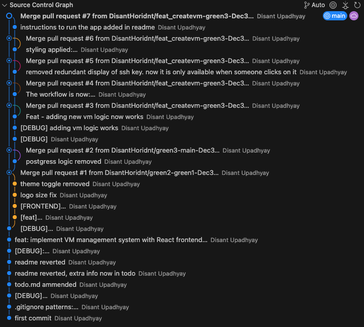

# V2 Cloud VM Management Dashboard

## Key Features

- **VM Lifecycle Management**: Create, view, and manage virtual machines effortlessly
- **SSH Key Management**: Secure and flexible SSH key handling
- **Responsive UI**: Modern, clean interface built with React and Tailwind CSS
- **Quick Configuration**: Instant VM updates with minimal friction

## Prerequisites

- Docker
- Docker Compose

## Quick Start

### Installation

```bash
git clone https://github.com/DisantHoridnt/v2cloud-assessment.git
cd v2cloud-assessment
```

### Running the Application

```bash
docker-compose up --build
```

🌐 Access the dashboard at: `http://localhost:8000/`

## Technical Stack

- **Backend**: Django REST Framework
- **Frontend**: React
- **Styling**: Tailwind CSS
- **Containerization**: Docker

## Commit Tree
